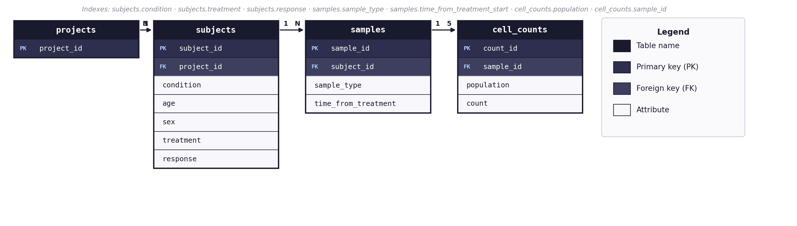

# CytoDash

Clinical Trial Immune Cell Population Analysis Dashboard

---

## Quick Start

**Requirements:** Python 3.11+, pip, Snakemake 7.32.4, Django 4.2+

```bash
# 1. Clone and install
git clone https://github.com/5c077/CytoDash.git && cd CytoDash
make setup

# 2. Run full pipeline (initializes DB, loads data, generates all outputs)
make pipeline

# 3. Launch interactive dashboard
make dashboard        # http://localhost:8000
```

**Makefile targets:**

| Target | Description |
|---|---|
| `make setup` | Installs all dependencies from `requirements.txt` |
| `make pipeline` | Executes `load_data.py` then Snakemake DAG end-to-end |
| `make dashboard` | Starts Django development server on port 8000 |

**GitHub Codespaces:** all paths are resolved relative to `app.py` and `load_data.py`.

---

## Repository Core Structure

```
CytoDash/
├── Makefile                  # setup · pipeline · dashboard targets
├── Snakefile                 # DAG: load → frequency → statistics → subset
├── requirements.txt
├── load_data.py              # Root-level specification
├── cell-count.csv
├── clinical_trial.db         # generated by make pipeline
├── scripts/
│   ├── analyze_frequency.py  
│   ├── analyze_statistics.py 
│   └── analyze_subset.py     
├── results/                  # outputs generated
│   ├── part2_frequency_table.csv
│   ├── part3_statistical_results.csv
│   ├── part3_boxplots/
│   └── part4_subset_summary.csv
└── dashboard/
    ├── app.py                # single-file Django app
    └── templates/            # base · index · part2 · part3 · part4
```

---

## Database Schema

The schema normalizes `cell-count.csv` into four tables following the third normal form (3NF) rule. Subject demographic attributes (condition, age, sex, treatment, response) are stored once in `subjects` rather than repeated per sample row, eliminating update anomalies. Cell population counts use a **long format** (one row per population per sample) so new markers can be added without major schema alterations.



*PK = primary key · FK = foreign key · relationships enforced by `PRAGMA foreign_keys = ON`*

### Cardinality

Each project contains many subjects (1:N). Each subject contributes many samples across timepoints (1:N). Each sample generates exactly five cell count rows (one per panel marker) establishing a fixed 1:5 relationship. Foreign key constraints enforce referential integrity at all levels: inserting a sample with a non-existent `subject_id` is rejected at the database level.

### ACID Compliance

- **Atomicity**: `load_data.py` performs all inserts within a single transaction; a failure at any point rolls back the entire load leaving the database in a clean initial state.
- **Consistency**: schema-level `NOT NULL` constraints on all foreign keys and population/count columns prevent structurally invalid rows. `PRAGMA foreign_keys = ON` enforces referential integrity on every connection.
- **Isolation**: SQLite WAL (Write-Ahead Logging) mode allows concurrent reads during pipeline execution without blocking.
- **Durability**: SQLite persists data to disk after each committed transaction; the `.db` file is the durable record.

### Scalability

The schema scales to hundreds of projects and thousands of samples without structural changes:

- `subjects.project_id`, `condition`, `treatment`, `response` are indexed for the query patterns used throughout the analysis (responder/non-responder comparisons, condition filtering).
- `samples.sample_type` and `time_from_treatment_start` are indexed to support timepoint stratification queries.
- `cell_counts.population` and `sample_id` are indexed to make per-population aggregations efficient at scale.
- Migrating from SQLite to PostgreSQL requires only a connection string change. Schema, queries, and indexes are fully compatible.
- Adding new cell populations requires inserting rows into `cell_counts` only. No `ALTER TABLE` or schema migration required.

### Idempotency

`load_data.py` uses `INSERT OR IGNORE` throughout and removes any existing database file before reloading, ensuring `make pipeline` is safe to re-run without the risk of data duplication.

---

## Code Structure & Design

### Pipeline Orchestration

Snakemake DSL orchestrates five stages as a dependency graph. `make pipeline` calls `python load_data.py` first (supporting root-level execution), then `snakemake --cores 1` executes the remaining stages:

- `load_data.py` → `clinical_trial.db`
- `analyze_frequency.py`: Frequency table (window function SQL)
- `analyze_statistics.py`: Per-timepoint Mann-Whitney w/ correction
- `analyze_subset.py`: Sample background characterization

### Statistical Methodology

**Test selection:** Mann-Whitney U (Wilcoxon rank-sum) was chosen over t-test because cell population percentage data is bounded [0, 100] and non-normally distributed. This test makes no assumption of sample size, normality, or homoscedasticity. 

**Multiple testing:** Benjamini-Hochberg FDR is the primary significance metric, consistent with an exploratory biomarker discovery convention. Bonferroni correction is reported as a conservative sensitivity check appropriate for clinical contexts where false positives carry high risk.

**Per-timepoint stratification:** Pooling timepoints treats repeated measures from the same subject as independent observations (pseudoreplication), inflating effective N and masking timepoint-specific effects. Analysis runs separately for each timepoint (0, 7, 14 days).

**Effect size:** Rank-biserial correlation (r = 1 − 2U/n₁n₂) accompanies each p-value. Thresholds: |r| < 0.1 negligible · 0.1–0.3 small · 0.3–0.5 medium · > 0.5 large.

### Dashboard Architecture

CytoDash is a single-file Django application (`dashboard/app.py`) configured programmatically without a settings module, eliminating nested package dependencies that can cause import failures. Key design decisions:

- **On-demand statistics and figure generation**: boxplot figures are rendered in-memory via `BytesIO` and returned as base64-encoded PNG in JSON responses. No file system writes during dashboard operation.
- **Server-side DataTables pagination**: 52,500 frequency rows are served via AJAX with dynamic filtering, avoiding browser memory limits.
- **`POPULATION_LABELS` dictionary**: single source of truth for cell type display names. Adding a new population requires one dictionary entry; all UI elements update automatically.
- **Statistical disclaimer**: arbitrary user-defined subsets inflate Type I error beyond reported corrections. A warning banner makes this explicit with every analysis run.
- **Collaborative design language**: light theme, red accent (#E8002D), left sidebar navigation, and SVG line icons are aligned with a great product aesthetic.

## Workflow

Development was accelerated through the use of AI tools.

## Dashboard

Start the dashboard locally with `make dashboard`, then navigate to `http://localhost:8000`.

The dashboard requires the database to be present in the repository root. Run `make pipeline` first if the database does not exist.